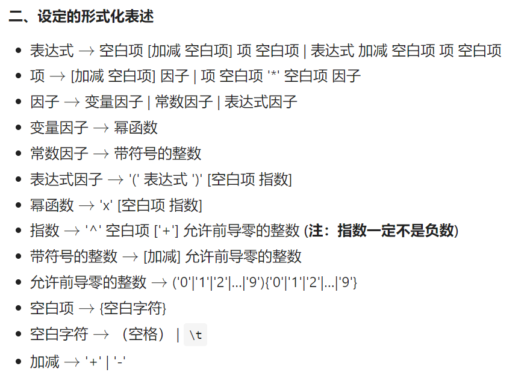
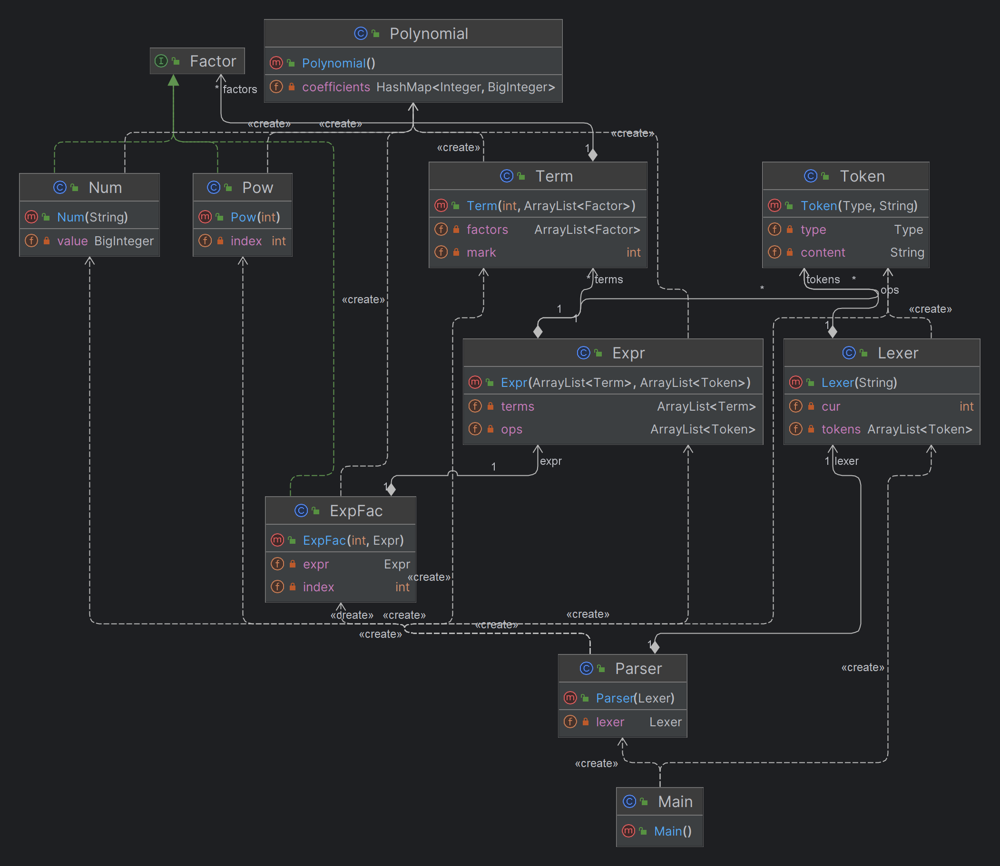

# 表达式解析：第一次作业
## 要求简述

第一次作业中处理的表达式还是比较单一的，关键在于我们该如何条理清晰地去处理这样一个给定的字符串。我的做法主要是来源于OO课程组提供的递归下降法，首先通过词法分析，语法分析，建立起语法树，再递归地去求解语法树的和。

## lexer词法分析
要去搞清楚一段表达式里面到底有什么东西，首先我们对表达式进行字符串层面上的处理。 

我们首先引入`Token`的概念，用它来代表表达式中的最小单元，一个运算符号`+`，一个数字`45`，以及一个左括号`(`，它们都是一个`Token`。第一次作业中，我们会处理到的`Token`有以下这些：
```java
    public enum Type {
        ADD, SUB, MUL, LPAREN, RPAREN, NUM, X, POWER
    }
```

我们建立起名字叫做`Lexer`的类来帮我们将整个表达式拆分成一个个的`Token`，为下一步我们分析表达式的层次结构做好了准备工作。 

在做词法分析生成`Token`之前，我们可以做一下小小的预处理工作，包括但不限于删去表达式中的空白字符，合并表达式中出现的连续的加减符号（可以证明，这样做并不会改变表达式的值，对下一步的语法分析也大有裨益）。

## Parser语法分析
经过上一步的处理之后，我们得到了一个由`Token`组成的表达式串，接下来我们来构建语法树。  

显然，在这样的树中，由上到下分别有表达式`Expr`，项`Term`，因子`Factor`，表达式由项用加减符号连接而成，项由因子用乘号连接而成。因子中还包括了三类，常数因子`Num`，变量因子（目前仅有幂函数）`Pow`，表达式因子`ExpFac`。我们可以设计一个`Factor`接口，来统一管理这三类因子，其中，表达式因子中一定还有表达式这一组成成分。


大致的构建语法树的过程：  

* 按照规则对**表达式**进行拆分 
* 识别出表达式中的**项**
* 按照规则对**项**进行拆分
* 识别出项中的不同**因子**
* 根据不同因子的不同格式，识别因子
* 构建出语法树

## 表达式的计算
其实表达式的计算方法在建立好语法树之后是非常清晰的，就是通过DPS来遍历整棵树。那么，在遍历的过程中，我们的计算结果该如何储存呢。 

我们可以发现，最终的表达式可以用$\sum_{i=1}^{n} a_i * x^{p_i}$来表示，基于此，我们建立起多项式类`Polynomial`来存储计算出的结果，其中包含了一个用幂函数的指数$p_i$来索引的HashMap。我们通过实现多项式的加减乘方法，来完成对表达式的计算。

计算完表达式之后，我们需要将表达式转化成字符串输出出来，为了让表达式尽可能短，可以采用一些小技巧，除了比较常见的对某些多项式中的项进行化简，比如系数为0、1或者指数为1的情况，我们可以通过将符号为正的项放在字符串前面，将符号为负的项放在字符串后面，尽可能避免字符串开头出现负号。

最后，附上我的UML类图：


## 评测姬与互测
强烈推荐大家学习并自己手动搭建评测姬，不但能大幅提高代码的质量，帮你在互测之中大杀四方，还能够增强你对于题目的理解，也提高了python编程水平。

推荐nrjj的[评测姬教学视频](https://www.bilibili.com/video/BV1hH4y1a7i6/?spm_id_from=333.337.search-card.all.click&vd_source=497fc7bc69c865d2abbe52ebed19b915)，nrjj是我永远的神！！！

关于这道题的评测姬搭建方法，其实就是根据表达式的相关定义去进行构建，我在搭建评测姬的时候主要大量利用了python的random库来随机产生一些不同的情况，我们可以通过调整一些概率参数，提高某些边缘情况出现的概率，具体做法我就不展开了。也有些大佬会采用一些独特的算法，提高生成数据的质量。代码对拍的时候，使用python中的一些库函数就可以判断两个表达式是否等价了。