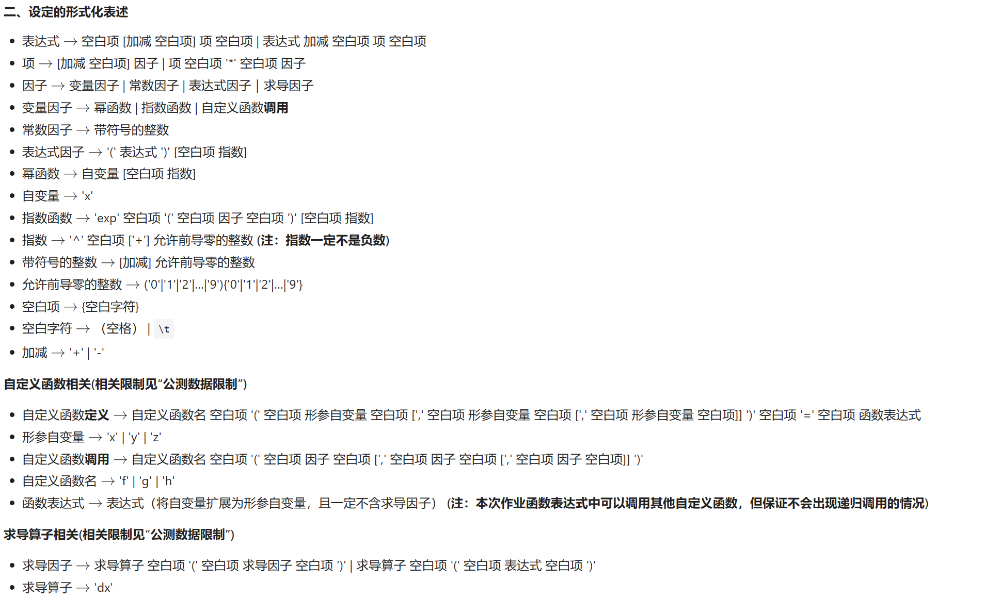

# 表达式解析：第三次作业

## 要求简述



总结一下，就只有两个新增部分：

* 函数定义的时候，函数表达式中可以含有已经定义好的自定义函数因子。
* 求导因子的实现。（我不明白为啥求导因子的形式化表达中，要把求导因子从表达式中单列出来，刚开始我还准备定义一个新的接口，让`Expr`和`DxFac`将它实现，后来发现完全没必要，直接按照`dx(expr)`的形式进行处理就好了。）

## 实现过程

笑死，不得不说今年课程组真是手下留情了，相比于去年的三角函数，今年的指数函数和求导根本不值一提。自定义函数的变化我相信大部分同学的代码不怎么修改就可以实现，我的代码中，只需要稍微改一下main函数中的内容就可以了。

对于求导因子，我们在进行词法和语法分析的时候，只需要仿照指数函数来实现就可以了，甚至求导因子外层甚至没有幂次。求导的过程，我放在了表达式计算的过程中。在`Polynomial`中实现求导方法，而在`DxFac`的`toPoly`方法中去调用它：

```java
public class DxFac implements Factor {
    //......
    @Override
    public Polynomial toPoly() {
        Polynomial exprPoly = expr.toPoly();
        return exprPoly.dx();
    }
}
```

毕竟，对多项式进行求导比较方便，因为单项式的形式是固定的，直接套相应的公式就好了。具体过程我不再赘述。

## 再谈表达式的长度优化

在上一篇中，我简单讲述了表达式中指数函数因子的优化，本次再来详细讲述一下一些简单的优化方法。（主要是，这次作业工作量太低了，自己给自己找一点事情做一下）

### 提公因子方法

本质上，该方法是将`exp(poly)`变成`exp(shortPoly)^index`,如果`poly`的长度大于`shortPoly`和`^index`的长度，那这将是一次不错的优化。在上一篇中，我只关注了单项的多项式的优化过程，本次我们将关注点放在多项的多项式。

对于公因子，我们会发现，提出幂函数并不能使长度降低，只有对多项式中单项式的系数操作才有意义。从直觉上来说，如果能够提出最大公因子（配合使用`BigInteger`中的`gcd()`和`divide()`方法即可实现该操作），那么多项式的长度会被最大程度上优化。在大部分情况下，这种方法是正确的，但请看下面这个实例：

```txt
exp((20*x+30*x^2+40*x^3))
```

容易发现，将公因数5提出来，比最大公因数10要好。因此如果我们计算出所有的公因子，将它们提出来的情况放在一起进行比较，可能会找出一个更加优秀的情况。这种做法的复杂度也可以接受，可以尝试一下。

当然，提公因子方法也不是万能的，请看下面两个实例：

```txt
exp((1001*x+1000*x^2+1000*x^3+1000*x^4))
exp((999*x+1000*x^2+1000*x^3+1000*x^4))
```

对多项式中某些项的系数进行微调，然后强行提公因子，这种方法属实逆天，但真的有优化仙人将它实现了，大家可以探索一下，我就懒得搞了，课程组今年在强测性能方面也没有难为我们，即使我没有对多项式进行提公因式的优化，强测分数也有98。